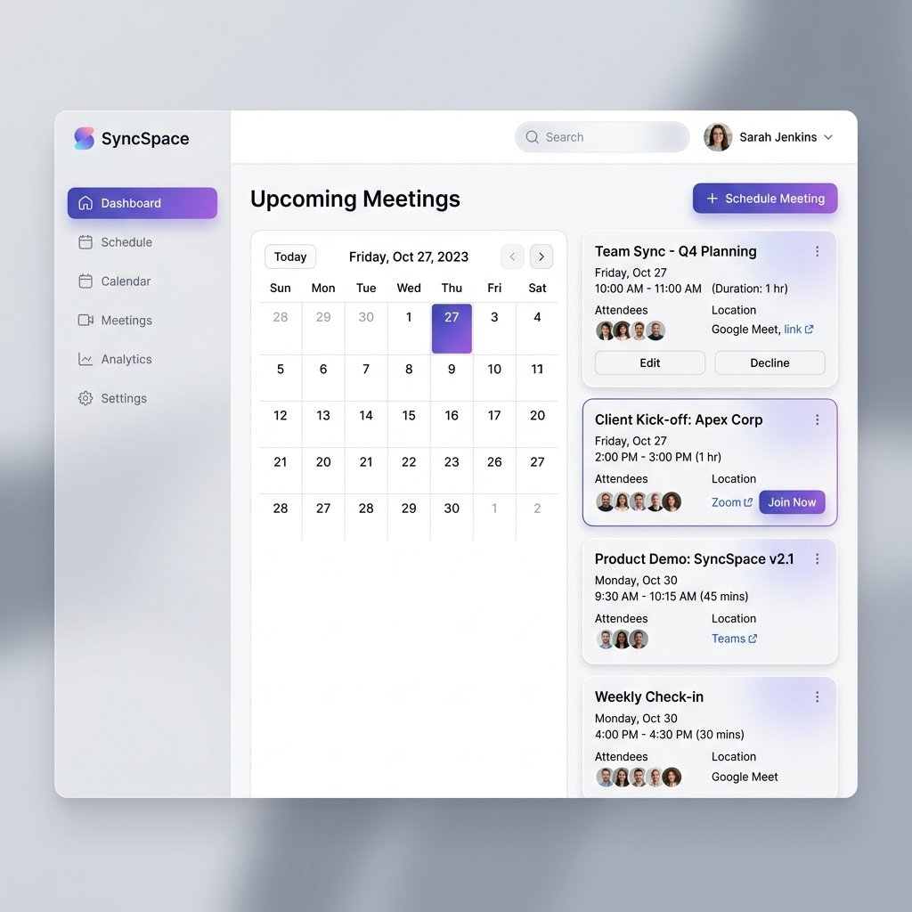

<div align="center">
  <h1>✨ SyncSpace ✨</h1>
  <p><strong>A Modern, Premium Web Application for Scheduling and Managing Meetings</strong></p>
  
  <p>
    <a href="https://react.dev"></a>
    <a href="https://vitejs.dev"></a>
    <a href="https://tailwindcss.com"></a>
    <a href="https://zustand-demo.pmnd.rs/"></a>
  </p>
</div>

<br />

<div align="center">
  
</div>

<br />

## 🚀 Overview

**SyncSpace** is an elegantly designed meeting scheduler built for speed, responsiveness, and a premium user experience. With its intuitive interface and seamless state management, organizing your calendar has never felt this good. 

## 🌟 Key Features

- **Modern & Premium UI/UX:** A stunning interface featuring glassmorphism, soft shadows, vibrant gradients, and micro-animations designed entirely with **TailwindCSS**.
- **Effortless Meeting Management:** Schedule, update, or cancel upcoming meetings in just a few clicks.
- **Interactive Time Picking:** Seamlessly select meeting dates and durations using a beautifully integrated `react-datepicker`.
- **Lightning-Fast State Management:** Powered by `zustand` to ensure your meeting list updates instantly without unnecessary re-renders.
- **Real-Time Notifications:** Integrated with `react-toastify` to provide immediate, non-intrusive feedback on your actions.
- **Smart Sorting & Empty States:** Automatically organizes meetings chronologically and provides a beautiful empty state when your schedule is clear.

## 🛠️ Technology Stack

| Technology | Purpose |
| :--- | :--- |
| **[React 19](https://react.dev/)** | Core UI library for building dynamic and interactive components |
| **[Vite](https://vitejs.dev/)** | Ultra-fast build tool and development server |
| **[TailwindCSS](https://tailwindcss.com/)** | Utility-first CSS framework for custom, premium styling |
| **[Zustand](https://github.com/pmndrs/zustand)** | Small, fast, and scalable bearbones state-management |
| **[Day.js](https://day.js.org/)** | Minimalist JavaScript library for parsing, validating, and formatting dates |

## 📦 Getting Started

### Prerequisites

Ensure you have [Node.js](https://nodejs.org/) installed on your local machine (version 16 or higher is recommended).

### Installation & Setup

1. **Clone the repository:**
   ```bash
   git clone https://github.com/PJain7988/MeetingScheduleApp.git
   ```

2. **Navigate to the application directory:**
   ```bash
   cd Meeting_Schedule_App/my-app
   ```

3. **Install the required dependencies:**
   ```bash
   npm install
   ```

4. **Start the local development server:**
   ```bash
   npm run dev
   ```

5. **Open your browser:**
   Navigate to `http://localhost:5173` to see SyncSpace in action!

## 🤝 Contributing

Contributions, issues, and feature requests are welcome! Feel free to check the [issues page](https://github.com/PJain7988/MeetingScheduleApp/issues) if you want to contribute.

## 📜 License

This project is licensed under the **MIT License**. Feel free to use, modify, and distribute it as you see fit.
